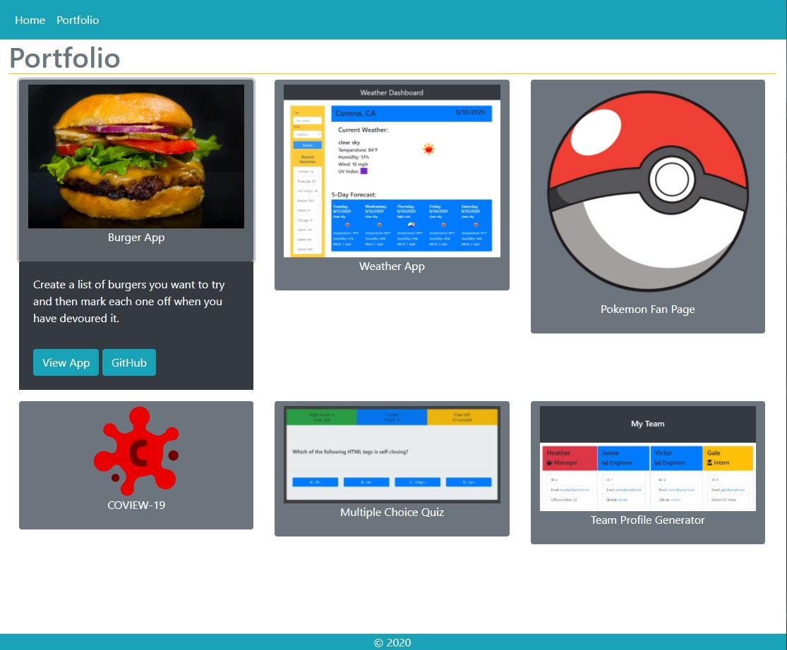

# React Portfolio

This portfolio was bootstrapped with [Create React App](https://github.com/facebook/create-react-app).
It also uses Reactstrap deployed on Heroku.

## Features

* Mobile responsive

* Portfolio showcases 6 total projects from my time as a UCI Coding Boot Camp student

* Built using React, including React Router, & Reactstrap

* A `Header` and `Footer` component that appears on multiple pages

* A single `Project` component that will be used multiple times on a single page 

* Linked GitHub profile with more of my work, including pinned repositories featuring those same 6 showcased projects

### Developer
Pat Downer 

### Screenshots 

### GitHub Link
https://github.com/PatDowner/portfolio